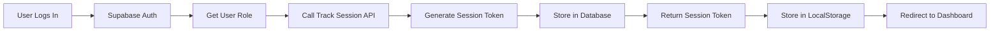

# 🔐 Admin Session Tracking System

## Overview

The Admin Session Tracking System provides comprehensive monitoring and management of all admin login sessions across your Travunited platform. This security feature helps you:

- **Monitor active sessions** in real-time
- **Track login history** with device and location information
- **Force logout suspicious sessions** immediately
- **Audit admin activity** for security compliance
- **Detect unauthorized access** through IP tracking

---

## 📋 Features

### 1. **Automatic Session Tracking**
- Tracks every admin login automatically
- Records IP address, device type, browser, and OS
- Monitors session duration and last activity time
- Differentiates between dashboard types (super-admin, admin, content-manager)

### 2. **Security Monitoring**
- View all active sessions across the platform
- Identify suspicious login patterns
- Track multiple concurrent sessions per user
- Monitor admin activity from different locations

### 3. **Session Management**
- Force logout any active session
- Auto-expire inactive sessions (24 hours)
- Manual logout tracking with reasons
- Session token validation

### 4. **Comprehensive Analytics**
- Total session counts
- Active vs inactive sessions
- Unique user tracking
- Dashboard-specific statistics
- Session duration analysis

---

## 🗄️ Database Schema

### Table: `admin_sessions`

```sql
CREATE TABLE public.admin_sessions (
    id UUID PRIMARY KEY,
    user_id UUID REFERENCES auth.users(id),
    session_token TEXT UNIQUE,
    
    -- Security Information
    ip_address TEXT,
    user_agent TEXT,
    device_type TEXT,  -- mobile, desktop, tablet
    browser TEXT,      -- chrome, firefox, safari
    os TEXT,           -- windows, macos, linux, ios, android
    
    -- Dashboard Access
    dashboard_type TEXT,  -- super-admin, admin, content-manager
    
    -- Timing
    login_at TIMESTAMPTZ DEFAULT NOW(),
    logout_at TIMESTAMPTZ,
    last_activity_at TIMESTAMPTZ DEFAULT NOW(),
    
    -- Status
    is_active BOOLEAN DEFAULT true,
    logout_reason TEXT  -- manual, timeout, forced, expired
);
```

---

## 🚀 Setup Instructions

### Step 1: Create Database Table

Run the SQL schema in your Supabase SQL Editor:

```bash
# File: database/admin-sessions-schema.sql
```

Or manually execute:

```sql
-- Copy contents from database/admin-sessions-schema.sql
-- Paste into Supabase SQL Editor
-- Click "Run"
```

**⚠️ Important Note:** The schema uses the `user_role` enum with **UPPERCASE** values:
```sql
'SUPER_ADMIN'  -- NOT 'super_admin'
'CUSTOMER'     -- NOT 'customer'
'OPS_HEAD'     -- NOT 'ops_head'
etc.
```

If you get an enum error, your database enum values are correct (uppercase).

### Step 2: Verify RLS Policies

The schema includes Row Level Security (RLS) policies:

- ✅ Super admins can view all sessions
- ✅ Regular admins can view only their own sessions
- ✅ All authenticated users can create sessions (on login)
- ✅ Users can update their own sessions (on logout)
- ✅ Super admins can force logout any session

### Step 3: Test the Feature

1. **Login as an admin user**
2. **Navigate to Super Admin → Session Tracking**
3. **View your active session**
4. **Test force logout** (create another session and force logout)

---

## 📱 Usage Guide

### For Super Admins

#### **View All Sessions**

1. Go to `/super-admin/sessions`
2. See all admin sessions across the platform
3. Filter by:
   - **Status**: All, Active, Inactive
   - **Dashboard Type**: Super Admin, Admin, Content Manager

#### **Force Logout a Session**

1. Find the session you want to terminate
2. Click **"Force Logout"** button
3. Confirm the action
4. Session is immediately terminated

#### **Monitor Security**

Look for:
- ❌ Multiple sessions from different IP addresses
- ❌ Unusual login times or locations
- ❌ Sessions from unknown devices
- ❌ Long-running active sessions

---

### For Regular Admins

#### **View Your Sessions**

1. Go to `/admin/sessions` (coming soon)
2. See your own active sessions
3. Monitor your login history
4. Logout sessions you don't recognize

---

## 🔧 API Endpoints

### 1. **Track Session** (POST)
```typescript
POST /api/auth/track-session
Body: { dashboardType: 'super-admin' | 'admin' | 'content-manager' }
Response: { success: true, sessionToken: string }
```

**Automatically called on login** - no manual implementation needed.

### 2. **Update Session Activity** (PUT)
```typescript
PUT /api/auth/track-session
Body: { 
  sessionToken: string,
  action: 'update_activity' | 'logout',
  logoutReason?: string
}
```

### 3. **Get Active Sessions** (GET)
```typescript
GET /api/auth/track-session
Response: { success: true, sessions: Session[], count: number }
```

### 4. **Get All Sessions** (Super Admin Only)
```typescript
GET /api/super-admin/sessions?is_active=true&dashboard_type=super-admin
Response: { success: true, sessions: Session[], total: number }
```

### 5. **Force Logout Session** (Super Admin Only)
```typescript
POST /api/super-admin/sessions/{id}/force-logout
Response: { success: true, message: string }
```

---

## 🎯 Session Lifecycle

### 1. **Login** (Session Creation)



### 2. **Active Session** (Activity Tracking)

- Session token stored in `localStorage`
- `last_activity_at` updated periodically
- `is_active` remains `true`

### 3. **Logout** (Session Termination)

**Manual Logout:**
```typescript
PUT /api/auth/track-session
{ 
  sessionToken: "...",
  action: "logout",
  logoutReason: "manual"
}
```

**Forced Logout (by Super Admin):**
```typescript
POST /api/super-admin/sessions/{id}/force-logout
// Sets is_active = false, logout_reason = 'forced'
```

**Auto Expire (24 hours inactive):**
```sql
-- Run periodically (cron job or manual)
SELECT expire_inactive_sessions();
```

---

## 🔍 Utility Functions

### 1. **Expire Inactive Sessions**

```sql
SELECT expire_inactive_sessions();
-- Automatically marks sessions inactive after 24 hours
```

### 2. **Force Logout All User Sessions**

```sql
SELECT force_logout_user_sessions('user-uuid-here');
-- Logs out all active sessions for a specific user
```

### 3. **Get Active Session Count**

```sql
SELECT get_active_session_count('user-uuid-here');
-- Returns number of active sessions for a user
```

---

## 📊 Analytics Queries

### Active Sessions by Dashboard Type

```sql
SELECT 
    dashboard_type,
    COUNT(*) as active_sessions,
    COUNT(DISTINCT user_id) as unique_users
FROM admin_sessions
WHERE is_active = true
GROUP BY dashboard_type;
```

### User Login History

```sql
SELECT 
    u.email,
    s.login_at,
    s.logout_at,
    s.ip_address,
    s.browser,
    s.os,
    s.is_active
FROM admin_sessions s
JOIN auth.users u ON s.user_id = u.id
ORDER BY s.login_at DESC;
```

### Suspicious IP Detection

```sql
SELECT 
    ip_address,
    COUNT(*) as session_count,
    COUNT(DISTINCT user_id) as unique_users,
    MAX(login_at) as last_login
FROM admin_sessions
GROUP BY ip_address
HAVING COUNT(DISTINCT user_id) > 3  -- Multiple users from same IP
ORDER BY session_count DESC;
```

### Average Session Duration

```sql
SELECT 
    AVG(EXTRACT(EPOCH FROM (logout_at - login_at))) / 3600 as avg_hours
FROM admin_sessions
WHERE logout_at IS NOT NULL;
```

---

## 🛡️ Security Best Practices

### 1. **Monitor Regularly**
- Check session dashboard daily
- Review unusual login patterns
- Track failed login attempts (coming soon)

### 2. **Force Logout When Needed**
- Suspicious IP addresses
- Former employees (after role removal)
- Compromised accounts
- Multiple concurrent sessions from different locations

### 3. **Set Up Alerts** (Future Enhancement)
- Email alerts for new admin logins
- Notifications for multiple failed attempts
- Warnings for concurrent sessions from different IPs

### 4. **Regular Cleanup**
- Run `expire_inactive_sessions()` daily
- Archive old session data (older than 90 days)
- Review and update RLS policies

---

## 🔗 Integration with Audit Logs

Session tracking integrates with the Audit Logs system:

```typescript
// Force logout creates an audit log entry
await supabase.from('audit_logs').insert({
  user_id: current_admin_id,
  action: 'force_logout_session',
  resource_type: 'admin_session',
  resource_id: session_id,
  changes: {
    forced_by: current_admin_id,
    reason: 'Manual force logout by super admin'
  }
});
```

---

## 🎨 UI Components

### Sessions Dashboard

**Location:** `/super-admin/sessions`

**Features:**
- ✅ Real-time active session count
- ✅ Filter by status (all/active/inactive)
- ✅ Filter by dashboard type
- ✅ Device icons (mobile/desktop/tablet)
- ✅ Browser and OS information
- ✅ IP address display
- ✅ Session duration calculation
- ✅ Force logout button
- ✅ Status badges

### Quick Stats Cards

1. **Total Sessions** - All session records
2. **Active Now** - Currently active sessions
3. **Inactive** - Logged out sessions
4. **Unique Users** - Distinct admin users

---

## 🧪 Testing Checklist

### Manual Testing

- [ ] **Login Tracking**
  - [ ] Login as super admin → Check session created
  - [ ] Login as regular admin → Check session created
  - [ ] Verify session token in localStorage
  - [ ] Verify session in database

- [ ] **Session Dashboard**
  - [ ] View all sessions as super admin
  - [ ] Filter by active/inactive
  - [ ] Filter by dashboard type
  - [ ] Verify device/browser/OS detection

- [ ] **Force Logout**
  - [ ] Force logout another admin's session
  - [ ] Verify session marked inactive
  - [ ] Verify audit log created
  - [ ] Verify user is logged out

- [ ] **Auto Expiry**
  - [ ] Create session
  - [ ] Update `last_activity_at` to 25 hours ago
  - [ ] Run `expire_inactive_sessions()`
  - [ ] Verify session marked inactive

---

## 🚨 Troubleshooting

### Issue: Sessions not being created

**Solution:**
1. Check Supabase connection
2. Verify RLS policies are enabled
3. Check browser console for errors
4. Verify API route is accessible

### Issue: Can't see other users' sessions

**Solution:**
1. Verify you're logged in as super admin
2. Check user role in `users` table
3. Verify RLS policy: `Super admins can view all sessions`

### Issue: Force logout not working

**Solution:**
1. Check super admin permissions
2. Verify session ID is correct
3. Check audit logs for error messages
4. Verify RLS policy: `Super admins can update any session`

---

## 📈 Future Enhancements

### Planned Features

1. **Real-time Session Monitoring**
   - WebSocket integration for live updates
   - Push notifications for new logins
   - Session hijacking detection

2. **Advanced Analytics**
   - Login heatmaps by time/location
   - Failed login attempt tracking
   - Geo-location mapping

3. **Automated Security**
   - Auto-logout on suspicious activity
   - Rate limiting for login attempts
   - Two-factor authentication integration

4. **Session Limits**
   - Max concurrent sessions per user
   - Auto-logout oldest session when limit reached
   - Device-specific session management

---

## 📞 Support

For issues or questions about Session Tracking:

- **Technical Support:** info@travunited.com
- **Security Concerns:** Immediately force logout and contact admin
- **Feature Requests:** Create GitHub issue or contact development team

---

## ✅ Deployment Checklist

Before deploying to production:

- [ ] Run `database/admin-sessions-schema.sql` in Supabase
- [ ] Verify all RLS policies are active
- [ ] Test login tracking in staging environment
- [ ] Test force logout functionality
- [ ] Set up cron job for `expire_inactive_sessions()`
- [ ] Create backup of session data
- [ ] Document session retention policy
- [ ] Train super admins on session management
- [ ] Set up monitoring alerts

---

**🎉 Your Admin Session Tracking is now ready!**

Monitor, manage, and secure all admin access to your Travunited platform.

